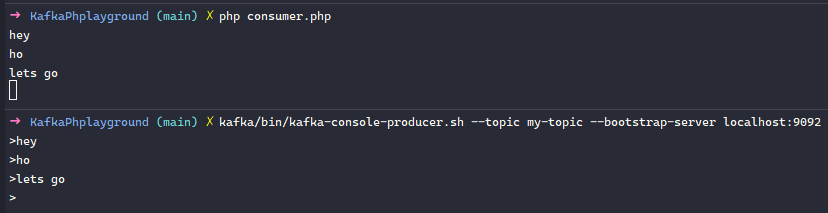

# Kafka PHPlayground

⚽ Just some fun with Kafka, PHP and Swoole

## Requirements

- PHP >= 7.4 (https://launchpad.net/~ondrej/+archive/ubuntu/php)
- Swoole >= 4.5 (https://www.swoole.co.uk/docs/get-started/installation)
- Java >= 8 (https://openjdk.java.net/install/)

## Instructions

### Kafka

- Download it from https://kafka.apache.org/downloads
- Extract to `<project root>/kafka`
  - `test -f kafka/bin/kafka-server-start.sh && echo OK` (should print `OK`).

#### Start the services

- `kafka/bin/zookeeper-server-start.sh kafka/config/zookeeper.properties`
- `kafka/bin/kafka-server-start.sh kafka/config/server.properties`

#### Create a topic

- `kafka/bin/kafka-topics.sh --create --topic my-topic --bootstrap-server localhost:9092`
  - `Created topic my-topic.` should be the response 

### PHP

#### If you don't have Swoole already:

- `pecl install swoole`

#### Install dependencies

Mainly https://github.com/easy-swoole/kafka

- `composer install`

#### Start the consumer

- `php consumer.php` 

## Let's play!

### Write some events

- `kafka/bin/kafka-console-producer.sh --topic my-topic --bootstrap-server localhost:9092`

Then just type some messages to the stdin. Press `Ctrl+C` top stop.

